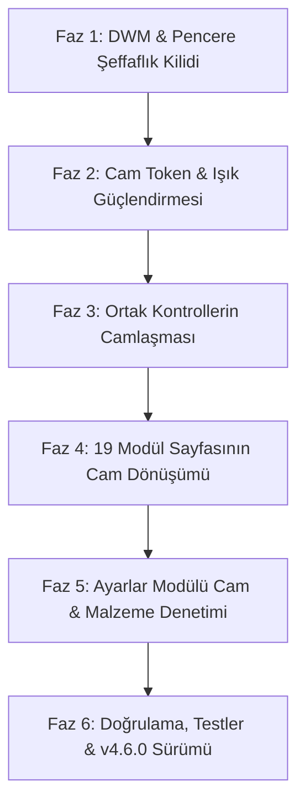

# Bakım — Büyük Windows 11 Cam (Mica + Glassmorphism) Tasarım Master Planı

> **Hedef:** Bakım uygulamasını, Windows 11'in en üst düzey yerel uygulamaları (Ayarlar, Dosya Gezgini sekmeleri, Microsoft Store, Windows Terminal) ile aynı görsel derinlik ve malzeme kalitesine kavuşturmak.  
> Uygulamanın 19 modülünün tamamı; saydam başlık ve kenar çubuğu, gerçek DWM Mica/Acrylic tabanı, çift odaklı ortam aurası (ambient lighting), speküler cam kenarlık ışığı (`Card.Stroke.Glass`) ve yarı saydam buzlu cam kartlarla tek bir pürüzsüz cam heykel gibi çalışacaktır.

---

## 0. Kök Neden Analizi: Neden "Hala Tam Cam Gibi Değil"?

| # | Teşhis Edilen Sorun | Teknik Kök Neden | Çözüm |
|---|---|---|---|
| **1** | **Mica Dışarıdan Görünmüyor** | `ui:FluentWindow` üzerinde `Background="Transparent"` eksik ve `ApplicationBackgroundBrush` değeri `#202020` opak renkle boyanıyor. DWM Mica açık olsa bile WPF pencere kökünde opak bir duvar örülüyor. | `MainWindow.xaml` içinde `Background="Transparent"` tanımlanacak; `ApplicationBackgroundBrush` backdrop açıkken `Transparent` / `Surface.WindowTint` ile eşitlenecek. |
| **2** | **Kart ile Katman Arasında Kontrast Yok** | `Layer.Fill` (%3.9 alfa) ve `Card.Fill` (%5.1 alfa) arasındaki fark yalnızca %1.2'dir. İnsan gözü bu iki katmanı ayırt edemez; kartlar cam gibi değil, düz gri gibi görünür. | `Layer.Fill` %16 - %22, `Card.Fill` %14 - %18 şeffaf örtüye çekilecek; kartın üst kenarına %40 beyaz speküler ışık kenarlığı (`Card.Stroke.Glass`) verilecek. |
| **3** | **Ortam Işığı Çok Sönük** | `Surface.AmbientLight` ve `Surface.AmbientSecondary` degradelerinin merkez alfa değeri sadece %10'dur. Koyu zemin üzerinde neredeyse görünmezdir. | Merkez alfa %24 - %30'a yükseltilecek; radyal yayılım 1000 px yapılarak cam kartların gövdesinden süzülen renk kırılması (refraction) belirginleştirilecek. |
| **4** | **Modüllerdeki Kartlar Homojen Değil** | Bazı sayfalar `Card.Surface`, bazıları `StatCard`, bazıları `ui:CardControl` (Card.Setting), bazıları ise ham `Border` kullanıyor. Çoğu kontrol kendi içinde opak fırçalara düşüyor. | Tüm kart sınıfları (`StatCard`, `Card.Setting`, `SummaryStrip`, `MetricTile`, `ListCard`) merkezi cam malzeme sistemine (`Card.Fill` + `Card.Stroke.Glass`) bağlanacak. |
| **5** | **Backdrop Türü Sabit ve Seçilemiyor** | Yalnızca standart gri `Mica` kullanılıyor. Windows 11'in derin renkli `Mica Alt (Tabbed)` ve gerçek buzlu cam `Akrilik` modları kullanıcıya sunulmuyor. | Ayarlar sayfasına "Cam & Malzeme" grubu eklenecek; `Mica`, `Mica Alt` ve `Akrilik` çalışma zamanında dinamik olarak değiştirilebilecek. |

---

## 1. Windows 11 Fluent 2 Malzeme Mimarisi

```
┌────────────────────────────────────────────────────────────────────────┐
│ WINDOWS 11 DWM TABANI (Desktop Wallpaper Passthrough)                   │
│   ├── WindowBackdropType = Mica / Tabbed (Mica Alt) / Acrylic          │
│   └── FluentWindow: Background = Transparent                           │
├────────────────────────────────────────────────────────────────────────┤
│ KÖK ÖRTÜ KATMANI (Surface.WindowTint)                                   │
│   ├── Başlık Çubuğu: %100 Saydam, DWM camı doğrudan görünür            │
│   ├── Kenar Çubuğu: %100 Saydam, DWM camı doğrudan görünür             │
│   │    └── Seçili Öğe: %6 İnce Beyaz Sis (Subtle.Fill.Selected) + 3×16 │
│   │                                                                    │
│   └── İÇERİK KATMANI (Layer.Fill + Layer.Stroke)                       │
│        ├── Sol-Üst Köşe Radius: 8 px                                   │
│        ├── Zemin: %18 Yarı Saydam Örtü                                 │
│        ├── Kenarlık: 1 px Sol/Üst İnce Cam Çizgisi                     │
│        │                                                               │
│        ├── ✦ Ortam Işığı Aurası (Surface.AmbientLight - Sağ Üst, %28)  │
│        ├── ✦ İkincil Aura (Surface.AmbientSecondary - Sol Alt, %16)    │
│        │                                                               │
│        └── CAM KARTLAR (Card.Surface, StatCard, Card.Setting...)       │
│             ├── Zemin: %15 Frosted White Örtü (Card.Fill)              │
│             ├── Kenarlık: Speküler Degrade Işık (Üst %40 → Alt %8)     │
│             ├── Yarıçap: 8 px (CornerRadius="{StaticResource Radius.MD}│
│             └── Hover: %22 Örtü + Kenar Parlaması (Card.Fill.Hover)    │
└────────────────────────────────────────────────────────────────────────┘
```

---

## 2. Token ve Renk Standartları (v2 Cam Spesifikasyonu)

### 2.1 Yüzey ve Örtü Token'ları

| Token Adı | Koyu Tema Değeri | Açık Tema Değeri | Açıklama ve Rol |
|---|---|---|---|
| `Surface.WindowTint` | `#1A...` (%10 temanın rengi) | `#1A...` (%10) | Pencere kök tabanı; DWM Mica'nın üzerine hafif marka tonu serer. |
| `Layer.Fill` | `rgba(255, 255, 255, 0.08)` + taban tonu | `rgba(255, 255, 255, 0.65)` | İçerik katmanı; tabandan ayrılan yarı saydam çalışma alanı. |
| `Layer.Stroke` | `rgba(255, 255, 255, 0.14)` | `rgba(0, 0, 0, 0.08)` | İçerik katmanının sol ve üst 1 px ayrım kenarlığı. |
| `Card.Fill` | `rgba(255, 255, 255, 0.07)` | `rgba(255, 255, 255, 0.75)` | Standart buzlu cam kart zemin dolgusu. |
| `Card.Fill.Secondary` | `rgba(255, 255, 255, 0.04)` | `rgba(240, 240, 240, 0.50)` | Kart içi iç içe bölgeler ve liste başlıkları. |
| `Card.Fill.Hover` | `rgba(255, 255, 255, 0.12)` | `rgba(255, 255, 255, 0.90)` | Tıklanabilir kartların fare üzerine gelme (hover) dolgusu. |
| `Card.Stroke.Glass` | Üst: `%35` Beyaz → Alt: `%8` Beyaz | Üst: `%80` Beyaz → Alt: `%12` Siyah | Fiziksel cam kenarındaki ışık kırılması (specular light edge). |
| `Control.Fill` | `rgba(255, 255, 255, 0.08)` | `rgba(255, 255, 255, 0.70)` | Butonlar ve giriş alanlarının cam dolgusu. |
| `Control.Stroke.Elevation` | Üst: `%20` Beyaz → Alt: `%8` Beyaz | Üst: `%10` Siyah → Alt: `%25` Siyah | Düğmelerin 3B derinlik hissi veren alt kenar çizgisi. |
| `Subtle.Fill.Hover` | `rgba(255, 255, 255, 0.07)` | `rgba(0, 0, 0, 0.05)` | Liste satırları ve sol menü butonlarının üzerine gelme dolgusu. |
| `Subtle.Fill.Selected` | `rgba(255, 255, 255, 0.09)` | `rgba(0, 0, 0, 0.07)` | Sol menüde ve sekmelerde seçili öğenin ince beyaz sisi. |
| `Divider.Stroke` | `rgba(255, 255, 255, 0.08)` | `rgba(0, 0, 0, 0.06)` | Yumuşak, göze batmayan cam ayırıcı çizgiler. |

### 2.2 Donmuş Ortam Işıkları (Ambient Lighting Brushes)

1. **`Surface.AmbientLight` (Sağ Üst Köşe):**
   - Merkez: `(1.0, 0.0)`
   - Yarıçap: `RadiusX = 1.3`, `RadiusY = 1.3`
   - Gradient Stop 0: Vurgu Rengi (Accent) ile `%26` alfa (`WithAlpha(color, 0x42)`)
   - Gradient Stop 1: Vurgu Rengi ile `%00` alfa (şeffaf geçiş)
2. **`Surface.AmbientSecondary` (Sol Alt Köşe):**
   - Merkez: `(0.0, 1.0)`
   - Yarıçap: `RadiusX = 1.1`, `RadiusY = 1.1`
   - Gradient Stop 0: İkincil Renk ile `%16` alfa (`WithAlpha(color, 0x28)`)
   - Gradient Stop 1: İkincil Renk ile `%00` alfa

---

## 3. Ortak Bileşenlerin Camlaştırılması (Controls Architecture)

| Bileşen | Dosya Yolu | Yapılacak Dönüşüm |
|---|---|---|
| `c:StatCard` | `Controls/StatCard.xaml` | Opak `CardBackgroundFillColorDefaultBrush` yerine `Card.Fill` ve `Card.Stroke.Glass` stili. Hover ve IsSelected durumlarında pürüzsüz cam aydınlatması. |
| `c:MetricTile` | `Themes/Controls/Layout.xaml` | Cam kart tabanı; altındaki sparkline dolgusunun %24'ten %0'a dikey yumuşak degradeli kırpılması. |
| `c:SummaryStrip` | `Themes/Controls/Layout.xaml` | Katman üstünde yüzen akrilik özet barı (`Card.Surface.Compact` cam stili). |
| `c:ListCard` & Satırlar | `Themes/Controls/Layout.xaml` | Cam liste kabuğu; satır ayırıcılarında `Divider.Stroke`; hover'da `Subtle.Fill.Hover`. |
| `ui:CardControl` (`Card.Setting`) | `Themes/Controls/Fluent.xaml` | Tweaker, Ayarlar ve Araçlar'da kullanılan tüm ayar kartları cam kart stiline (`Card.Fill` + `Card.Stroke.Glass`) geçirilir. |
| `Link.Button` | `Themes/Controls/Fluent.xaml` | Çerçevesiz, temiz metin köprü düğmesi; hover'da `Subtle.Fill.Hover`. |
| `c:ModulePage` | `Themes/Controls/Layout.xaml` | Standart cam sayfa kabuğu; kaydırma çubuğunun katman içinde 4 px içeride yüzmesi. |

---

## 4. Tüm 19 Modül Sayfasının Cam Dönüşüm Matrisi

### 4.1 Çekirdek & Performans Modülleri
1. **`DashboardModuleView.xaml` (Kontrol Paneli):**
   - Sistem Sağlık Kartı: `Card.Surface.Hero` (vurgu tonlu cam, parlak üst cam kenarlığı).
   - Canlı Metrikler (CPU, RAM, Disk, Ağ): 4 adet `MetricTile` cam kutucuğu, donmuş degrade sparkline grafikleri.
   - Hızlı Eylemler ve Etkinlikler: `Card.Surface` cam kartları.
2. **`CleanerModuleView.xaml` (Temizleyici):**
   - Özet Şeridi (`SummaryStrip`): 4 adet cam `StatCard`.
   - Temizleme Hedefleri Izgarası: Her kategori kutusu etkileşimli cam kart (`Card.Surface.Interactive`).
   - Taranan Dosyalar Listesi: Şeffaf sanallaştırılmış liste, cam detay çekmecesi.
3. **`OptimizerModuleView.xaml` (Hızlı Bakım & Optimizasyon):**
   - Hızlı Optimizasyon Kartı: `Card.Surface.Hero` odaklı cam kart.
   - Optimizasyon Görev Grupları: `Card.Surface` cam kartları ve cam onay kutuları.
4. **`StartupModuleView.xaml` (Başlangıç Uygulamaları):**
   - Başlangıç Süresi ve Etki Özeti: Cam `SummaryStrip`.
   - Başlangıç Uygulamaları Listesi: Cam `ListCard` satırları, yerel Windows 11 `ToggleSwitch` kontrolleri.
5. **`GameModeModuleView.xaml` (Ultra Oyun Modu):**
   - Oyun Modu Durum Kartı: `Card.Surface.Hero` vurgulu cam kart.
   - Oyun Kütüphanesi Izgarası (Steam/Epic/GOG): Her oyun kutucuğu cam kart (`Card.Surface.Interactive`).
   - İnce Ayar Satırları: Cam `Card.Setting` bileşenleri.

### 4.2 Donanım & Sistem Analiz Modülleri
6. **`SystemInfoModuleView.xaml` (Sistem Bilgisi):**
   - Windows 11 "Hakkında" Tarzı Cihaz Kartı: `Card.Surface.Hero` (İşlemci, RAM, Windows sürümü ve Kopyala düğmesi).
   - Donanım Bileşen Kartları (Anakart, GPU, Depolama, Ağ, BIOS): Her donanım kategorisi bağımsız bir cam `Card.Surface`.
7. **`NetworkMonitorModuleView.xaml` (+ 5 Alt Panel):**
   - Canlı Ağ Hızı & Trafik Kartı: `Card.Surface` ve degrade alan grafiği.
   - Ağ Bağdaştırıcıları & Aktif Bağlantılar: Cam tablolar ve `Subtle.Fill.Hover` satırlar.
8. **`StorageModuleView.xaml` (+ 3 Alt Panel):**
   - Disk Doluluk Halka Kartı: `Card.Surface.Hero` cam kart.
   - Disk Haritası & Büyük Dosyalar: Cam liste kartları (`ListCard`).
   - Yinelenen Dosyalar: Seçim grupları cam kartları.
9. **`CrashAnalyzerModuleView.xaml` (Olaylar & Güvenilirlik):**
   - Güvenilirlik İndeksi (0-100): `Card.Surface.Hero` cam kahraman kartı.
   - Çökme Zaman Çizelgesi: Cam `ListCard` ve olay seviyesi `StatusGlyph` glifleri.

### 4.3 Yönetim & Güvenlik Modülleri
10. **`SentinelModuleView.xaml` (Kurulum Nöbetçisi):**
    - Koruma Durumu & Canlı İzleyici: `Card.Surface.Hero` cam kalkan kartı.
    - Oturum Geçmişi & Değişiklik İnceleme Listesi: Cam kartlar ve `Divider.Stroke` ayırıcılar.
11. **`UninstallerModuleView.xaml` (Program Kaldırıcı):**
    - Kaldırıcı KPI Kartları: Cam `StatCard` bileşenleri (tıklanabilir filtreleme özellikli).
    - Program Listesi: Sanallaştırılmış cam liste; çoklu seçimde altta yüzen akrilik işlem çubuğu.
12. **`ServiceManagerModuleView.xaml` (Windows Servisleri):**
    - Servis Filtre Çipleri: `Subtle` cam haplar.
    - Servis Tablosu: Cam kart içerisine yerleştirilmiş sanallaştırılmış satırlar.
13. **`PrivacyDebloatModuleView.xaml` (Gizlilik & Telemetri):**
    - Gizlilik Puanı ve Koruma Kartı: `Card.Surface.Hero`.
    - Bloatware Kaldırıcı Izgarası: Etkileşimli cam kutucuklar.
14. **`AnalyzerView.xaml` (Sezgisel Tehdit Analizörü):**
    - Tarama Durumu ve Risk Özeti: Cam kahraman kartı.
    - PE Başlık ve İmza Bulguları: Cam `ListCard` satırları.
15. **`ActivityCenterView.xaml` (Etkinlik Merkezi):**
    - Günlük Zaman Çizelgesi: Tek parça dikey akrilik/cam çizelge kartı.

### 4.4 Windows Araçları, Mağaza & Ayarlar
16. **`WindowsTweakerModuleView.xaml` (12 Kategori Windows İnce Ayarları):**
    - 12 kategorideki tüm ayar kartları `Card.Surface` / `Card.Setting` cam kartlarına dönüştürülür.
17. **`WindowsToolsModuleView.xaml` (24 Sistem Konsolu & Yönetim Aracı):**
    - 24 aracın tamamı tıklanabilir cam kutucuklara (`Card.Surface.Interactive`) kavuşturulur.
18. **`StoreModuleView.xaml` (Açık Kaynak Yazılım Mağazası):**
    - Öne Çıkanlar Şeridi: Cam kahraman vitrini.
    - Uygulama Kartları: Belirgin speküler cam kenarlık, resmi Fluent simgeler.
19. **`SettingsModuleView.xaml` (Ayarlar):**
    - Canlı Tema Önizleme Kutucukları (`ThemePreview`): Cam mini pencereler.
    - **YENİ "Cam & Malzeme" Grubu:**
      - Pencere Malzemesi Seçici: `Mica`, `Mica Alt (Tabbed)`, `Akrilik`, `Kapalı (Opak)`.
      - Ortam Işığı Anahtarı: Açık / Kapalı.
      - Saydamlık Modu: Windows'u Takip Et / Zorunlu Cam / Opak.

---

## 5. Sıfır Performans Kaybı ve WPF Güvencesi

1. **Sıfır `BlurEffect` / Sıfır `VisualBrush`:**
   - WPF içindeki `BlurEffect` her karede CPU/GPU'yu yeniden çizer ve 18 sayfada takılmaya (stutter) yol açar.
   - Cam hissi, donanım destekli DWM Mica/Acrylic, yarı saydam örtüler ve **önceden dondurulmuş (Frozen) radyal degradelerle** sıfır gecikmeyle (60+ FPS) üretilecektir.
2. **Dondurulmuş Fırçalar (Frozen Brushes):**
   - Tüm degrade ve katman fırçaları `ThemeService` içerisinde bir kez oluşturulur ve anında `.Freeze()` edilir; bellek sızıntısı ve GPU yeniden derlemesi önlenir.

---

## 6. Uygulama Yol Haritası ve Fazlar



- **Faz 1: DWM & Pencere Şeffaflık Kilidi:** `MainWindow.xaml` `Background="Transparent"` yapılması, `ApplicationBackgroundBrush` şeffaflık düzeltmesi, `WindowBackdropType` esnekliği.
- **Faz 2: Cam Token & Işık Güçlendirmesi:** `Layer.Fill`, `Card.Fill` ve `Surface.AmbientLight` radyal fırça alfa değerlerinin insan gözünün zevk alacağı Windows 11 cam kontrastına yükseltilmesi.
- **Faz 3: Ortak Kontrollerin Camlaşması:** `StatCard`, `Card.Setting`, `SummaryStrip`, `MetricTile`, `ListCard` kontrollerinin cam sistemine bağlanması.
- **Faz 4: 19 Modül Sayfasının Cam Dönüşümü:** 4 grup halinde tüm sayfaların cam kart ve layout standartlarına geçirilmesi.
- **Faz 5: Ayarlar Modülü Cam & Malzeme Denetimi:** Kullanıcının Mica / Mica Alt / Akrilik seçebileceği ayar grubunun entegrasyonu.
- **Faz 6: Doğrulama, UI Duman Testleri & Auto-Deploy:** 4 doğrulama scripti (`verify-tokens.py`, `verify-symbols.py`, `verify-design-debt.py`, `verify-bindings.py`), 783 birim testi ve `v4.6.0` sürümünün GitHub Releases'e otonom dağıtımı.
